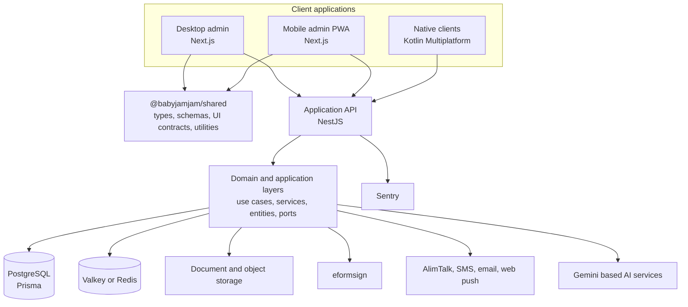
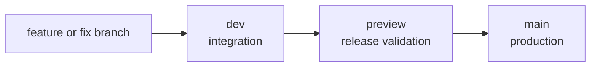

<div align="center">
  

  <h1>BabyJamJam Operations Platform</h1>

  <p><strong>아가잼잼 산모·신생아 건강관리 운영 플랫폼</strong></p>

  <p>
    A branch aware operations platform for maternal and newborn home care providers in South Korea.
    It brings client intake, workforce coordination, contracts, service records, pricing,
    communications, document workflows, and AI assisted administration into one product system.
  </p>

  <p>
    
    
    
    
    
  </p>
</div>

> [!IMPORTANT]
> This repository is an active proprietary product. Public source availability does not grant
> permission to copy, redistribute, deploy, or create derivative works. See
> [License and ownership](#license-and-ownership).

## Contents

- [Platform overview](#platform-overview)
- [Product capabilities](#product-capabilities)
- [System architecture](#system-architecture)
- [Repository structure](#repository-structure)
- [Application portfolio](#application-portfolio)
- [Technology stack](#technology-stack)
- [Engineering architecture](#engineering-architecture)
- [Local development](#local-development)
- [Commands](#commands)
- [Testing and quality gates](#testing-and-quality-gates)
- [Security and data handling](#security-and-data-handling)
- [Deployment and release flow](#deployment-and-release-flow)
- [Documentation](#documentation)
- [Contribution workflow](#contribution-workflow)
- [License and ownership](#license-and-ownership)

## Platform overview

BabyJamJam is the operational system of record for organizations that coordinate maternal and
newborn home care services. The platform supports the complete service lifecycle from the first
consultation through client registration, caregiver assignment, contract execution, service record
collection, communications, and administrative follow up.

The repository is organized as a pnpm workspace with one API service, two Next.js applications, a
Kotlin Multiplatform client, and a shared package that centralizes contracts and governance across
the web products.

### Product principles

| Principle | Meaning |
|---|---|
| One operational source of truth | Client, employee, schedule, contract, pricing, and communication data are managed through one platform. |
| Branch scoped access | Requests are evaluated against the active branch, user role, and branch membership before domain data is exposed. |
| Workflow over isolated CRUD | Features are designed around real operating sequences such as consultation intake, matching, contract creation, and service completion. |
| Automation with explicit controls | AI, messaging, notifications, and document automation run behind defined application services, permissions, and review paths. |
| Shared contracts across clients | Desktop and mobile applications consume shared types, schemas, UI contracts, and utilities from `@babyjamjam/shared`. |
| Enforced interface consistency | The Glint design system and repository ESLint rules prevent uncontrolled page level UI generation. |
| Production oriented observability | Runtime errors, source maps, structured operational events, and failure paths are designed for investigation. |

## Product capabilities

| Domain | Capabilities |
|---|---|
| Client lifecycle | Consultation intake, client drafts, registration, profile management, status tracking, service dates, assigned caregivers, and branch scoped search. |
| Workforce operations | Caregiver and staff records, availability, status management, assignments, and branch membership. |
| Scheduling | Employee schedules, client service periods, assignment coordination, and schedule aware operational views. |
| Contracts and documents | Contract creation, eformsign integration, mirrored document records, PDF and audit trail handling, document linking, and client assignment safeguards. |
| Service records | Secure service record links, employee verification, record entry, lifecycle tracking, document generation, and administrative review. |
| Pricing and finance | Voucher price tables, out of pocket price information, regional bank account settings, and pricing support for contract workflows. |
| Messaging | Message composition, templates, sender approval, delivery policy, automation settings, delivery history, AlimTalk and SMS integration, email, and web push. |
| Consultation and call intake | Consultation inquiries, call transcript ingestion, structured extraction, retryable processing, client draft review, and conversion into registered clients. |
| AI assistance | Tenant aware administrative chat, explicit tool execution, operational lookups, and structured assistance for approved administrative users. |
| Administration | User onboarding, role management, branch selection, system administration, feature policy, notifications, and organization level controls. |

## System architecture



The API owns business rules and external integrations. Client applications are responsible for
presentation, interaction state, and authenticated access to the API. Shared web contracts live in
the workspace package rather than being duplicated between the desktop and mobile applications.

## Repository structure

```text
.
├── backend/                  NestJS API and business application
│   ├── domain/               Entities, value objects, repository contracts, and ports
│   ├── application/          Use cases, services, policies, and orchestration
│   ├── infrastructure/       Prisma, authentication, tenant isolation, vendors, and observability
│   ├── interface/            HTTP controllers and transport DTOs
│   ├── module/               NestJS feature composition
│   ├── prisma/               Database schema and migrations
│   └── test/                 Unit, integration, authentication, and full flow tests
├── frontend/                 Desktop administration application
├── mobile/                   Mobile first administration PWA
├── native/                   Kotlin Multiplatform Android and iOS clients
├── packages/
│   └── shared/               Shared types, schemas, utilities, UI contracts, and ESLint rules
├── docs/
│   ├── conventions/          Engineering conventions
│   ├── design-system/        Glint governance, component manifest, and debt baseline
│   ├── blog-posts/           Technical narratives and implementation notes
│   └── tasks/                Repository scoped task documentation
├── .github/
│   └── workflows/            Verification and release automation
├── AGENTS.md                 Repository rules for human and AI contributors
├── package.json              Workspace commands and dependency policy
└── pnpm-workspace.yaml       Workspace package definition
```

## Application portfolio

| Workspace | Primary audience | Responsibilities | Runtime |
|---|---|---|---|
| `backend` | All product clients | Authentication, tenant enforcement, domain workflows, persistence, integrations, automation, scheduled work, and observability | NestJS on Node.js |
| `frontend` | Desktop operations teams | Dense administrative workflows, dashboards, client and employee management, contracts, messaging, files, settings, and system administration | Next.js App Router |
| `mobile` | Mobile operations teams | Mobile optimized administration, field workflows, client and employee access, messaging, notifications, and service operations | Next.js PWA |
| `native` | Android and iOS users | Native authentication, networking, notifications, and platform specific experiences backed by shared Kotlin code | Kotlin Multiplatform, Jetpack Compose, SwiftUI |
| `packages/shared` | Web application developers | Shared API plumbing, types, Zod schemas, status contracts, date and business utilities, and custom ESLint rules | TypeScript package |

## Technology stack

| Area | Primary technologies |
|---|---|
| Workspace | pnpm 10, Node.js 20 or later |
| Web applications | Next.js 16, React 19, TypeScript 5 |
| UI foundation | Tailwind CSS 4, Radix UI, class variance authority, Framer Motion |
| Design system | Glint components, shared UI contracts, component manifest, custom ESLint enforcement |
| Server state | TanStack Query 5 |
| Client state | Zustand 5 |
| Validation | Zod 4, `class-validator`, `class-transformer` |
| API | NestJS 11, Express 5 |
| Persistence | PostgreSQL, Prisma 6 |
| Cache and rate limits | Valkey or Redis through `ioredis` |
| Authentication | Kakao OAuth, local email authentication, Passport, JWT, branch selection, role and tenant guards |
| Documents | eformsign, PDF processing, HWP rendering support, object storage |
| Communications | AlimTalk, SMS, SMTP or Resend email, web push |
| AI | Vercel AI SDK, Google Gemini gateways, explicit tool execution |
| Native | Kotlin Multiplatform, Jetpack Compose, SwiftUI, Ktor, Koin |
| Testing | Jest, Testing Library, Supertest, Playwright |
| Observability | Sentry for NestJS and Next.js |
| Hosting model | Railway for the API and Vercel for web applications |

## Engineering architecture

### Backend boundaries

The backend follows Clean Architecture with domain driven boundaries.

```text
Interface  ->  Application  ->  Domain  <-  Infrastructure
```

| Layer | Owns | Must not own |
|---|---|---|
| `domain` | Business entities, value objects, repository interfaces, domain ports, and invariant logic | Framework code, Prisma models, HTTP concerns, or vendor SDK behavior |
| `application` | Use cases, orchestration services, policies, schedulers, and transaction level workflows | HTTP request parsing or direct dependency on database implementations |
| `infrastructure` | Prisma repositories, mappers, authentication strategies, tenant context, external APIs, storage, email, AI gateways, and observability | Product presentation logic |
| `interface` | Controllers, request DTOs, response mapping, guards applied at transport boundaries | Core business rules |
| `module` | Dependency injection and feature composition | Domain behavior |

Repository implementations map persistence records into domain objects. External services are
accessed through ports or adapters so that tests can replace real vendors with isolated stubs.

### Tenant and role isolation

Business data is scoped to the active branch. The authenticated request principal contains the user,
selected branch, global role, and branch role. Owners can operate across active branches, while other
users must have an active membership in the selected branch.

A feature that reads or mutates branch data must preserve tenant context through the controller,
application service, repository query, and any background workflow.

### Web application architecture

The desktop and mobile applications use the following separation:

- Next.js App Router for routing, layouts, server boundaries, and route handlers.
- TanStack Query for remote server state, caching, invalidation, and mutations.
- Zustand for local interaction state that does not belong in the server cache.
- Zod for runtime validation at client boundaries.
- `@babyjamjam/shared` for shared contracts rather than copy and paste definitions.
- Feature components for domain behavior and Glint components for reusable interface structure.

Pages should compose templates and feature components. They should not become independent design
systems, data access layers, or collections of locally defined visual primitives.

### Glint design system

**Glint** is the canonical name of the BabyJamJam interface system.

Some implementation paths still contain the historical `v3` directory name while migration work is
completed. New product language, documentation, and component proposals must use the name Glint.

Glint governance is enforced through:

1. A component manifest with approved components and import paths.
2. Custom `ui-architecture/*` ESLint rules.
3. Required `data-component` ownership paths.
4. A UI debt baseline that may decrease but may not grow.
5. A CI gate through `pnpm lint:ui-architecture`.
6. Repository instructions in `AGENTS.md` and `docs/design-system/AGENT_UI_RULES.md`.

For UI work, read the design system rules and component manifest before editing a page.

### AI and automation boundaries

AI functionality is integrated as an application capability, not as unrestricted access to the
system.

- Administrative chat uses an explicit tool executor and approved domain modules.
- Call transcripts enter through authenticated ingestion paths and become reviewable client drafts.
- Extraction failures can be retried without duplicating completed work.
- Test environments use vendor stubs to prevent accidental external delivery or production side
  effects.
- Authorization and tenant checks remain authoritative even when an AI workflow initiates an action.

## Local development

### Prerequisites

Install the following tools before starting:

| Requirement | Version or note |
|---|---|
| Node.js | 20 or later |
| pnpm | 10.x. The repository pins `pnpm@10.33.0`. |
| PostgreSQL | A local or remote development database |
| Valkey or Redis | Recommended for authentication rate limit and distributed cache behavior |
| Java | 17, only for native development |
| Android Studio | Required for Android native development |
| Xcode | Required for iOS native development and available only on macOS |

Vendor credentials are not required for basic interface and domain work. They are required only when
testing the corresponding live integration. Use isolated test accounts and nonproduction resources.

### 1. Clone and install

```bash
git clone https://github.com/jaino-song/babyjamjam-admin.git
cd babyjamjam-admin

corepack enable
corepack prepare pnpm@10.33.0 --activate
pnpm install
```

Install dependencies from the repository root. Do not run independent package manager installs in
each workspace.

### 2. Configure environment files

```bash
cp .env.example .env.local
cp frontend/.env.example frontend/.env.local
cp mobile/.env.example mobile/.env.local
```

Review every value before starting the applications. At minimum, configure:

- PostgreSQL connection strings for the backend.
- A strong JWT secret and a separate email token HMAC secret.
- Desktop and mobile origins.
- The API base URL used by each web client.
- Valkey or Redis when exercising distributed rate limits.
- Only the vendor credentials required for the workflow under test.

For the standard local topology below, point both web applications to
`http://127.0.0.1:3001`.

Never commit populated `.env`, `.env.local`, authentication state, production identifiers, or vendor
credentials.

### 3. Prepare the database

```bash
pnpm --filter ./backend generate
pnpm --filter ./backend db:migrate
```

Optional development seed:

```bash
pnpm --filter ./backend db:seed
```

Use `db:migrate:deploy` only for controlled deployment environments. Do not use it as a substitute
for reviewing migration content.

### 4. Start the applications

The recommended local service map is:

| Service | URL | Command |
|---|---|---|
| Desktop admin | `http://localhost:3000` | `pnpm dev:fe` |
| API | `http://localhost:3001` | `pnpm dev:be` |
| Mobile admin | `http://localhost:3002` | `pnpm --dir mobile run dev -- --port 3002` |

Run each command in a separate terminal.

The backend development launcher resolves the machine LAN address for service record links. When the
mobile application runs on port `3002`, set `MOBILE_DEV_PORT=3002` in the shell that starts the
backend.

### 5. Native applications

Native development is separate from the pnpm workspace build.

```bash
cd native

# Android
./gradlew :androidApp:installDebug

# Shared tests
./gradlew :shared:allTests
```

For iOS framework generation and Xcode setup, follow
[`native/SETUP.md`](native/SETUP.md).

## Commands

### Workspace commands

| Command | Purpose |
|---|---|
| `pnpm dev:fe` | Start the desktop Next.js application |
| `pnpm dev:be` | Start the NestJS API in watch mode |
| `pnpm dev:mobile` | Start the mobile application on its default Next.js port |
| `pnpm build` | Build all pnpm workspaces sequentially |
| `pnpm test` | Run workspace test suites sequentially |
| `pnpm lint` | Run available workspace lint scripts |
| `pnpm lint:ui-architecture` | Reject growth in frontend or mobile UI architecture debt |

### Backend commands

| Command | Purpose |
|---|---|
| `pnpm --filter ./backend start:dev` | Start the API with watch mode and LAN service record URL resolution |
| `pnpm --filter ./backend build` | Generate Prisma client and compile the API |
| `pnpm --filter ./backend type-check` | Run TypeScript validation without emitting files |
| `pnpm --filter ./backend test` | Run the backend Jest suite |
| `pnpm --filter ./backend test:auth-e2e` | Run authentication end to end tests |
| `pnpm --filter ./backend e2e:full-flow` | Run the full flow end to end harness |
| `pnpm --filter ./backend db:migrate` | Create and apply a development migration |
| `pnpm --filter ./backend db:migrate:deploy` | Apply committed migrations in a deployment environment |

### Desktop and mobile commands

| Command | Purpose |
|---|---|
| `pnpm --filter ./frontend type-check` | Type check the desktop application |
| `pnpm --filter ./frontend test` | Run desktop Jest tests |
| `pnpm --filter ./frontend test:smoke` | Run the contract creation Playwright smoke flow |
| `pnpm --filter ./frontend test:screenshots` | Run desktop screenshot specifications |
| `pnpm --filter ./mobile type-check` | Type check the mobile application |
| `pnpm --filter ./mobile test` | Run mobile Jest tests |
| `pnpm --filter ./mobile test:e2e` | Run mobile Playwright tests |
| `pnpm --filter ./mobile test:screenshots` | Run mobile screenshot specifications |
| `pnpm --filter @babyjamjam/shared test` | Validate shared contracts and custom ESLint rules |

## Testing and quality gates

The repository uses layered verification rather than relying on a single test type.

| Surface | Verification |
|---|---|
| Domain and application logic | Jest unit tests with isolated repositories and vendor ports |
| Database adapters | Repository and mapper tests against expected persistence behavior |
| Authentication | Dedicated authentication end to end environment, rate limit coverage, email flow coverage, and branch selection behavior |
| API workflows | Supertest and full flow harnesses |
| Desktop UI | Jest, Testing Library, Playwright smoke tests, and screenshot specifications |
| Mobile UI | Jest, Testing Library, Playwright end to end tests, and screenshot specifications |
| Shared package | Jest tests, Node tests for ESLint rules, and TypeScript checks |
| Architecture | ESLint, strict TypeScript, Clean Architecture boundaries, shared contract use, and UI debt enforcement |
| Build integrity | Production builds for backend, desktop, and mobile |
| Runtime diagnosis | Sentry instrumentation, source map upload when configured, and structured operational logging |

### Minimum pull request validation

Run the checks relevant to the changed work. A broad repository validation is:

```bash
pnpm lint
pnpm lint:ui-architecture

pnpm --filter ./backend type-check
pnpm --filter ./frontend type-check
pnpm --filter ./mobile type-check
pnpm --filter @babyjamjam/shared type-check

pnpm test
pnpm build
```

Add focused end to end tests when a change crosses authentication, tenant, vendor, contract,
messaging, service record, or database boundaries.

A pull request description must report the commands that were actually executed. Do not claim a
check passed when it was not run.

## Security and data handling

This system processes sensitive operational and personal information. Development practices must
treat production data as confidential.

### Required practices

- Use anonymized fixtures and synthetic phone numbers, addresses, names, document identifiers, and
  transcripts in development and tests.
- Never commit secrets, access tokens, cookies, private keys, database dumps, production documents,
  Playwright authentication state, or screenshots containing personal information.
- Preserve branch and role enforcement in every data access path.
- Keep OAuth state binding, nonce validation, refresh behavior, and rate limits intact.
- Keep global DTO whitelisting and unknown field rejection enabled except for explicitly reviewed
  third party webhook boundaries.
- Keep production CORS origins explicit.
- Use E2E vendor stubs for automated tests so tests do not send real messages, emails, documents, or
  AI requests.
- Do not include sensitive logs or production payloads in public GitHub issues or pull requests.
- Rotate any credential immediately if it is exposed, even when the exposure is brief.

### Existing safeguards

The backend includes Helmet, strict global validation, explicit CORS configuration, OAuth callback
binding, authentication rate limits, branch tenant guards, role guards, vendor stub assertions,
Prisma error mapping, and Sentry exception handling.

Security controls are part of the product architecture. They must not be bypassed to simplify local
development.

## Deployment and release flow

The repository uses three long lived branches:



| Branch | Purpose |
|---|---|
| `dev` | Integration target for feature, fix, refactor, test, and documentation pull requests |
| `preview` | Staging and release candidate validation |
| `main` | Production release history and default repository branch |

### Release expectations

1. Create work from the latest `dev`.
2. Open a focused pull request into `dev`.
3. Pass relevant tests, type checks, lint, architecture gates, and builds.
4. Promote validated `dev` content into `preview`.
5. Validate deployment behavior and release critical workflows.
6. Promote `preview` into `main`.
7. Apply committed Prisma migrations through the deployment migration command.
8. Confirm Sentry release and source map configuration when production artifacts change.

Do not commit directly to `main`. Do not use a release promotion to hide unresolved test failures or
unreviewed schema changes.

The current hosting model uses Railway for the API and Vercel for the desktop and mobile web
applications. Environment variables, database credentials, vendor secrets, and release identifiers
are managed outside the repository.

## Documentation

| Resource | Purpose |
|---|---|
| [`backend/README.md`](backend/README.md) | Backend architecture, data access patterns, modules, routes, and test strategy |
| [`mobile/README.md`](mobile/README.md) | Mobile application structure and interface implementation |
| [`native/SETUP.md`](native/SETUP.md) | Android, iOS, and Kotlin Multiplatform setup |
| [`docs/design-system/AGENT_UI_RULES.md`](docs/design-system/AGENT_UI_RULES.md) | Mandatory Glint composition rules for human and AI contributors |
| [`docs/design-system/component-manifest.json`](docs/design-system/component-manifest.json) | Approved UI component catalog and import paths |
| [`frontend/docs/design-system/README.md`](frontend/docs/design-system/README.md) | Semantic atomic design guidance |
| [`docs/conventions/`](docs/conventions/) | Repository engineering conventions |
| [`docs/PWA_PUSH_NOTIFICATION_GUIDE.md`](docs/PWA_PUSH_NOTIFICATION_GUIDE.md) | Web push and PWA notification setup |
| [`docs/blog-posts/`](docs/blog-posts/) | Technical implementation narratives |
| [`docs/tasks/`](docs/tasks/) | Repository scoped task records |
| [`AGENTS.md`](AGENTS.md) | Mandatory repository instructions for agent assisted changes |

Update documentation in the same pull request when behavior, architecture, environment variables,
shared contracts, release flow, or developer commands change.

## Contribution workflow

### Before implementation

1. Pull the latest `dev`.
2. Create a focused branch.
3. Read the relevant domain documentation.
4. For UI work, read `AGENTS.md`, the Glint rules, and the component manifest first.
5. Identify affected tenant, authorization, migration, vendor, and test boundaries.
6. Define the validation plan before changing code.

### During implementation

- Keep domain logic out of controllers and page components.
- Prefer existing use cases, ports, shared contracts, and Glint components.
- Add a new abstraction only when it has a clear owner and reuse case.
- Keep database migrations explicit, reviewable, and backward aware.
- Add tests at the lowest useful layer and add integration coverage for boundary changes.
- Avoid unrelated formatting, generated artifacts, and opportunistic refactors in the same pull
  request.

### Pull request requirements

A pull request should include:

- A clear summary of the behavior or documentation changed.
- The reason for the change.
- User and operator impact.
- Architecture, database, security, or rollout considerations.
- Screenshots for visible interface changes.
- Exact validation commands and results.
- Follow up work that is intentionally outside the pull request.

Use conventional commit prefixes such as `feat`, `fix`, `refactor`, `test`, `docs`, `chore`, and
`release`.

## License and ownership

This repository is proprietary and is distributed without an open source license.

Unless the repository owner provides explicit written permission, you may not copy, modify,
redistribute, publish, sublicense, sell, host, or deploy this source code or any substantial portion
of it.

All rights are reserved by the repository owner.
